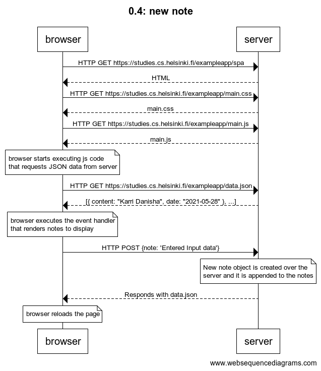
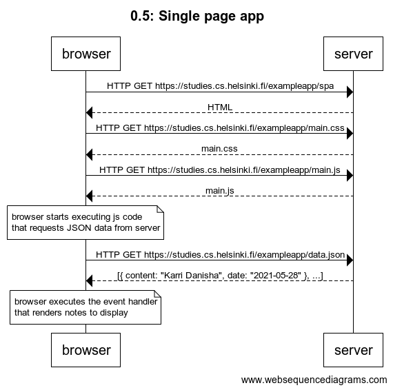
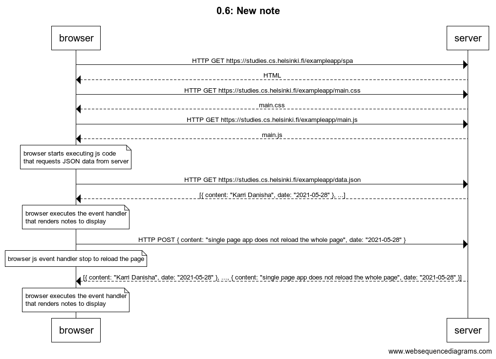

# 0.4: New Note
```
Title 0.4: new note


browser->server: HTTP GET https://studies.cs.helsinki.fi/exampleapp/spa
server-->browser: HTML
browser->server: HTTP GET https://studies.cs.helsinki.fi/exampleapp/main.css
server-->browser: main.css
browser->server: HTTP GET https://studies.cs.helsinki.fi/exampleapp/main.js
server-->browser: main.js

note over browser: 
browser starts executing js code 
that requests JSON data from server
end note

browser->server: HTTP GET https://studies.cs.helsinki.fi/exampleapp/data.json
server-->browser: [{ content: "Karri Danisha", date: "2021-05-28" }, ...]

note over browser: 
browser executes the event handler 
that renders notes to display
end note

browser->server: HTTP POST {note: 'Entered Input data'}

note over server: 
New note object is created over the 
server and it is appended to the notes
end note
server-->browser: Responds with data.json

note over browser: browser reloads the page
```



<br/> 
<br/>

# 0.5: Single page app
```
title 0.5: Single page app

browser->server: HTTP GET https://studies.cs.helsinki.fi/exampleapp/spa
server-->browser: HTML
browser->server: HTTP GET https://studies.cs.helsinki.fi/exampleapp/main.css
server-->browser: main.css
browser->server: HTTP GET https://studies.cs.helsinki.fi/exampleapp/main.js
server-->browser: main.js

note over browser: 
browser starts executing js code 
that requests JSON data from server
end note

browser->server: HTTP GET https://studies.cs.helsinki.fi/exampleapp/data.json
server-->browser: [{ content: "Karri Danisha", date: "2021-05-28" }, ...]

note over browser: 
browser executes the event handler 
that renders notes to display
end note
```



<br/> 
<br/>

# 0.6: Single page app
```
title 0.6: New note

browser->server: HTTP GET https://studies.cs.helsinki.fi/exampleapp/spa
server-->browser: HTML
browser->server: HTTP GET https://studies.cs.helsinki.fi/exampleapp/main.css
server-->browser: main.css
browser->server: HTTP GET https://studies.cs.helsinki.fi/exampleapp/main.js
server-->browser: main.js

note over browser: 
browser starts executing js code 
that requests JSON data from server
end note

browser->server: HTTP GET https://studies.cs.helsinki.fi/exampleapp/data.json
server-->browser: [{ content: "Karri Danisha", date: "2021-05-28" }, ...]

note over browser: 
browser executes the event handler 
that renders notes to display
end note

browser->server: HTTP POST { content: "single page app does not reload the whole page", date: "2021-05-28" }

note over browser: browser js event handler stop to reload the page

server-->browser: [{ content: "Karri Danisha", date: "2021-05-28" }, ..., { content: "single page app does not reload the whole page", date: "2021-05-28" }]

note over browser: 
browser executes the event handler 
that renders notes to display
end note
```
